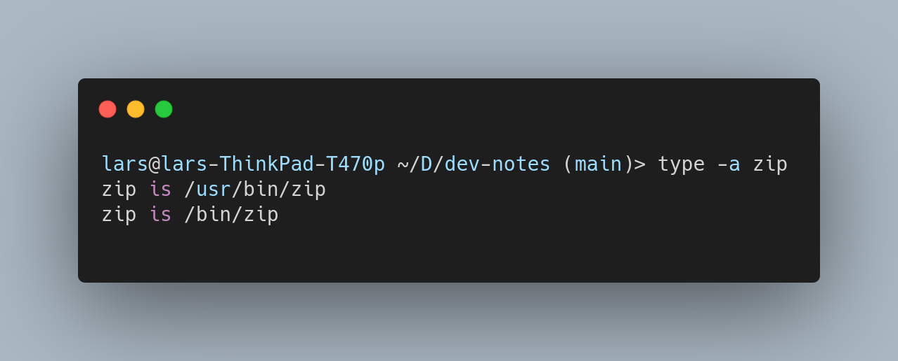

## `which` vs `type`

### which

  - finds executable in your `$PATH`
  - lives in /usr/bin/which

### type

  - if used with the `-a` flag ("all"), it determines if the command is an alias, function, built-in command, cached executable (hashed) or binary in `$PATH`, etc
  - shell builtin

*Example output when used with the `-a` flag*




Other command options are: 

- `-t` single word output for the type, e.g. alias, buildin, function etc
- `-p` path to the disk file

## Users

Find user name belonging to user ID

```shell
id -un <ID>
```


## ssh

Connect to remote host via ssh with public key authentication. If no public/private key pair exists yet run first.

```ssh
ssh-keygen
```

Then copy the public key to the remote machine

```shell
ssh-copy-id <login user name>@<remote host name>
```

### alias 

Add to `/home/<user>/.ssh/config`

```
Host <your alias>
    HostName <full remote host name>
    User <login user name>
```

In combination with public key authentication you can now login to the remote machine without being prompted for a password with

```ssh
ssh <your alias>
```

### control path and master


Re-use an existing connection to server you already have logged into.

To enable for all hosts add the following to `/home/<user>/.ssh/config`

```
host *
    controlmaster auto
    controlpath ~/.ssh/control-%h-%p-%r
```

This will put the shared sockets in the ~/.ssh directory. 

- %h - Host
- %p - Port
- %r - Remote login username

Host, port and login username substitutions ensure unique shared connections.

### Resources

:octicons-link-external-16:  [ssh.com](https://www.ssh.com/academy/ssh/)