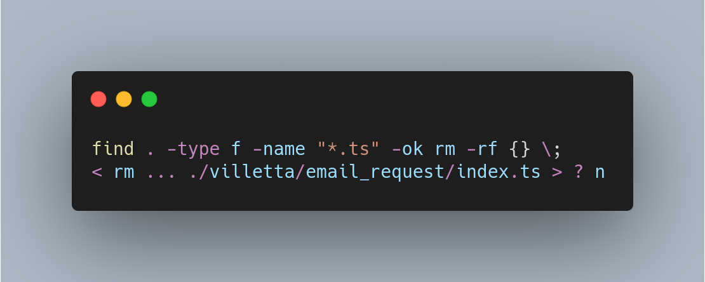

## `which` vs `type`

### which

  - finds executable in your `$PATH`
  - lives in /usr/bin/which

### type

  - if used with the `-a` flag ("all"), it determines if the command is an alias, function, built-in command, cached executable (hashed) or binary in `$PATH`, etc
  - shell builtin

*Example output when used with the `-a` flag*


Other command options are: 

- `-t` single word output for the type, e.g. alias, buildin, function etc
- `-p` path to the disk file

## Users

Find user name belonging to user ID

```shell
id -un <ID>
```


## ssh

Connect to remote host via ssh with public key authentication. If no public/private key pair exists yet run first.

```ssh
ssh-keygen
```

Then copy the public key to the remote machine

```shell
ssh-copy-id <login user name>@<remote host name>
```

### alias 

Add to `/home/<user>/.ssh/config`

```
Host <your alias>
    HostName <full remote host name>
    User <login user name>
```

In combination with public key authentication you can now login to the remote machine without being prompted for a password with

```ssh
ssh <your alias>
```

### control path and master


Re-use an existing connection to server you already have logged into.

To enable for all hosts add the following to `/home/<user>/.ssh/config`

```
host *
    controlmaster auto
    controlpath ~/.ssh/control-%h-%p-%r
```

This will put the shared sockets in the ~/.ssh directory. 

- %h - Host
- %p - Port
- %r - Remote login username

Host, port and login username substitutions ensure unique shared connections.

### Resources

:octicons-link-external-16:  [ssh.com](https://www.ssh.com/academy/ssh/)


## dig

Short for **G**et **D**omain **D**etails.


Possible types

Query type | Output | Function
--------- | ----------- | -----------
A	| IPv4 address record |	Returns an IPv4 address.
AAAA | IPv6 address record | Returns an IPv6 address.
SOA | A zone of authority record | Returns authoritative information about a DNS zone.
CNAME | Canonical name record | Returns an alias for the target domain and all subsequent aliases.
MX | Mail exchange record	Returns a list of message transfer agents assigned to the target domain.
PTR | Pointer record | Returns a canonical name. Most commonly used for reverse DNS look-ups.
NS | Name server record | Returns an authoritative name server for the target domain.


### Resources

:octicons-link-external-16:  [Julia Evans on how to use dig](https://jvns.ca/blog/2021/12/04/how-to-use-dig/)

:octicons-link-external-16:  [Example on how to solve DNS issues](https://www.code426.com/knowledge-base/dig-commands-to-solve-dns-issues/)


## find

General form 

```shell
  find (starting directory) (matching criteria and actions)
```

 To find all files under the current directory of type `plain text` with the file extension `.ts` 


```shell
  find . -type f -name "*.ts"
```


### Option `type`

Option | Description 
--------- | ----------- 
f	| plain text
d | directory

### Option `mtime`

The file was modified x days ago. You can use `+` and `-` operators to narrow down your search. 

Find csv files last modified more than 5 days ago

```shell
  find . -type f -mtime +5 "*.csv" 
```


Find csv files last modified last week

```shell
  find . -type f -mtime -7 "*.csv" 
```

### Action `exec`

You can execute a command that will be applied to all found files, like removing them. 

!!! attention "don't forget the backslash semicolon!"
    Commands you want to execute must end with `\;`

```shell
  find . -type f -name "*.ts" -exec rm -rf {} \;
```  

### Action `ok`

If you want to confirm the action before the command will be applied use `-ok` instead of `-exec`

```shell
  find . -type f -name "*.ts" -ok rm -rf {} \;
```  

This will prompt before actually executing the command




Use `y` or `yes` to confirm, `n` or `no` to abort. 